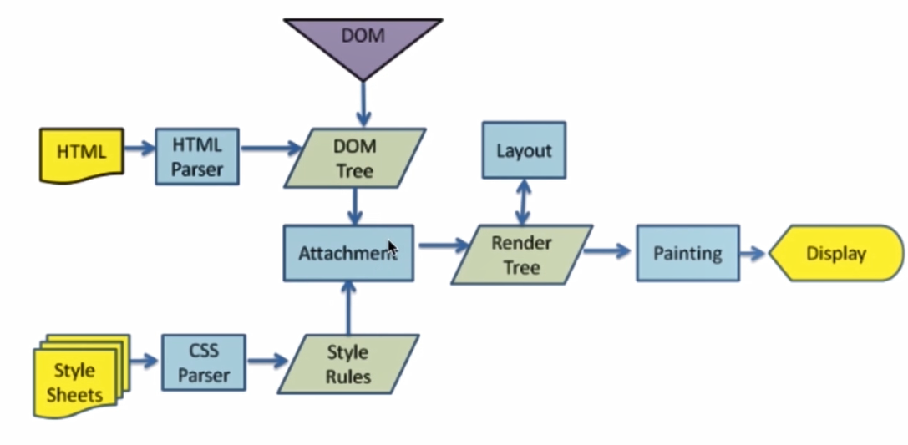

### 浏览器的渲染过程，DOM 树和渲染树的区别？

HTML 经过解析生成 DOM树； CSS经过解析生成　Style Rules。 二者一结合生成了Render Tree。
通过layout计算出DOM要显示的宽高、位置、颜色。
最后渲染在界面上，用户就看到了

浏览器的渲染过程：

 - 解析 HTML 构建 DOM(DOM 树)，并行请求 css/image/js
 - CSS 文件下载完成，开始构建 CSSOM(CSS 树)
 - CSSOM 构建结束后，和 DOM 一起生成 Render Tree(渲染树)
 - 布局(Layout)：计算出每个节点在屏幕中的位置
 - 显示(Painting)：通过显卡把页面画到屏幕上

DOM 树 和 渲染树 的区别：

 - DOM 树与 HTML 标签一一对应，包括 head 和隐藏元素
 - 渲染树不包括 head 和隐藏元素，大段文本的每一个行都是独立节点，每一个节点都有对应的 css 属性

### CSS会阻塞DOM解析吗？

对于一个HTML文档来说，不管是内联还是外链的css，都会阻碍后续的dom渲染，但是不会阻碍后续dom的解析。

当css文件放在<head>中时，虽然css解析也会阻塞后续dom的渲染，但是在解析css的同时也在解析dom，所以等到css解析完毕就会逐步的渲染页面了。

### 重绘和回流（重排）的区别和关系？

 - 重绘：当渲染树中的元素**外观**（如：颜色）发生改变，不影响布局时，产生重绘
 - 回流：当渲染树中的元素的**布局**（如：尺寸、位置、隐藏/状态状态）发生改变时，产生重绘回流
 - 注意：JS 获取 Layout 属性值（如：offsetLeft、scrollTop、getComputedStyle 等）也会引起回流。因为浏览器需要通过回流计算最新值
 - 回流必将引起重绘，而重绘不一定会引起回流

DOM结构中的各元素都有自己的盒子，这些都需要浏览器根据各种样式来计算并更具结果将元素放到它该出现的位置，这个过程叫 reflow

触发reflow 
 - 添加或删除可见的DOM元素。 
 - 元素位置改变。 
 - 元素的尺寸改变（包括：内外边距、边框厚度、宽度、高度等属性的改变）。 
 - 内容改变。 
 - 页面渲染器初始化。 
 - 浏览器窗口尺寸改变。

### 如何最小化重绘(repaint)和回流(reflow)？

以下几个操作会导致性能问题：
 - 改变 window 大小
 - 改变字体
 - 添加或删除样式
 - 文字改变
 - 定位或者浮动
 - 盒模型

解决方法：
 - 需要要对DOM元素进行复杂的操作时，可以先隐藏(display:"none")，操作完成后再显示
 - 需要创建多个 DOM 节点时，使用 DocumentFragment 创建完后一次性的加入 document，或使用字符串拼接方式构建好对应HTML后再使用innerHTML来修改页面
 - 缓存 Layout 属性值，如：var left = elem.offsetLeft; 这样，多次使用 left 只产生一次回流
 - 避免用 table 布局（table 元素一旦触发回流就会导致 table 里所有的其它元素回流）
 - 避免使用 css 表达式(expression)，因为每次调用都会重新计算值（包括加载页面）
 - 尽量使用 css 属性简写，如：用 border 代替 border-width, border-style, border-color
 -  批量修改元素样式：elem.className 和 elem.style.cssText 代替 elem.style.xxx

